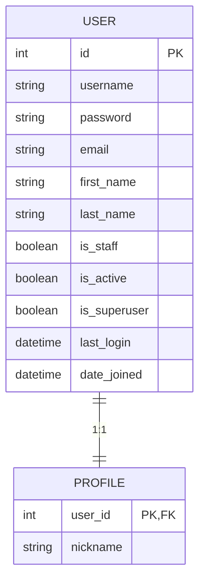

```mermaid
erDiagram
    USER {
        int id PK
        string username
        string password
        string email
        string first_name
        string last_name
        boolean is_staff
        boolean is_active
        boolean is_superuser
        datetime last_login
        datetime date_joined
    }

    PROFILE {
        int user_id PK, FK
        string nickname
    }

    USER ||--|| PROFILE : "1:1"
```